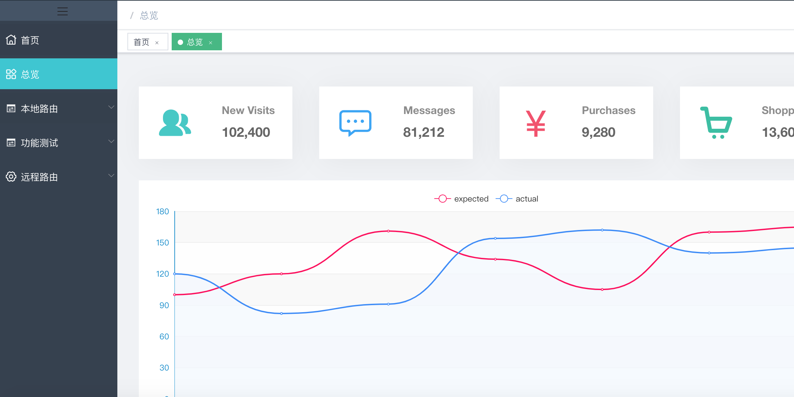
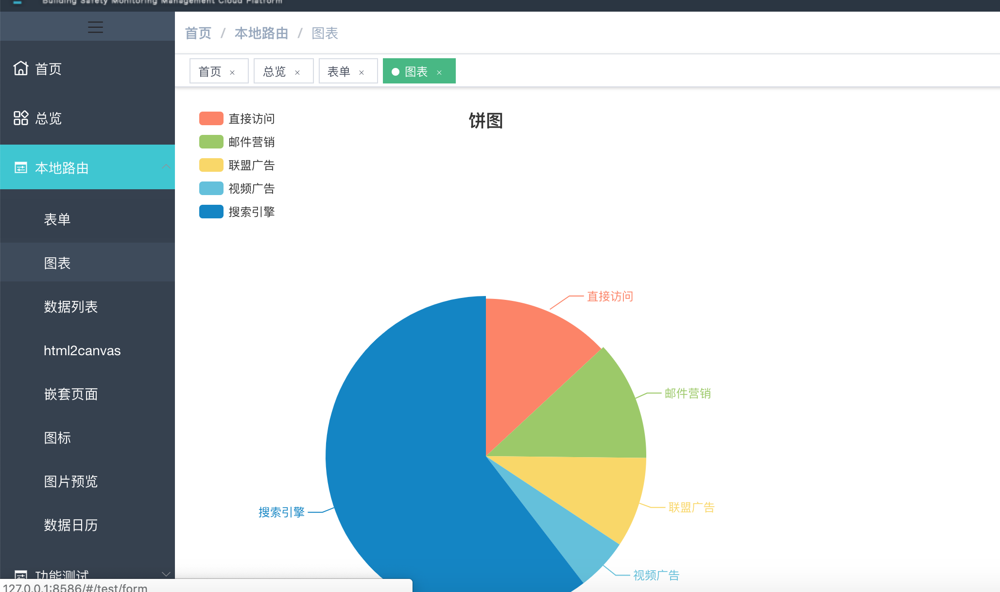
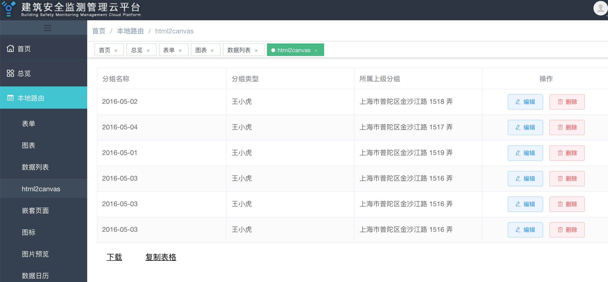
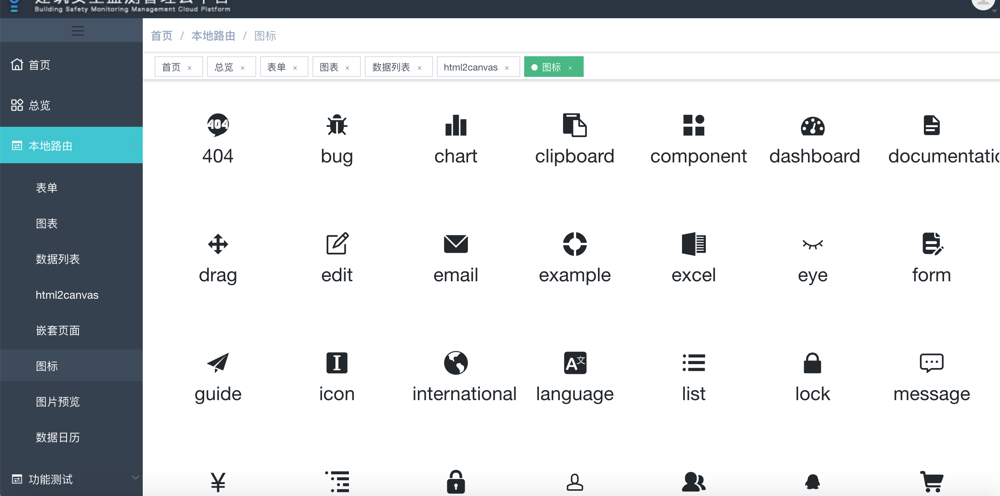
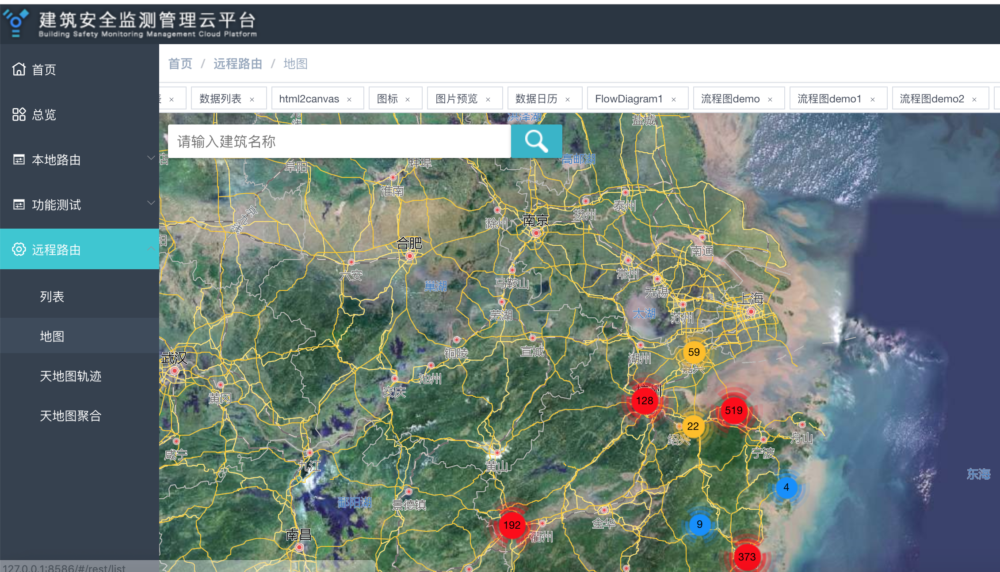

### 安装依赖
### npm install

### 启动项目
### npm start

# 已实现功能及组件

## 功能
- 登录
- 菜单权限控制（根据路由表）
- 菜单权限控制（根据角色）
- 按钮权限控制
- 表格示例
- 表单示例
- 图表示例
- 高德地图demo
- 天地图demo
- 上传组件
- 数据日历组件fullcalendar
- 图片预览组件 vue-photo-preview
- svg图标
- 页面iframe嵌套示例
- 404/500页面
- 标签栏
- 过滤器 filter
- 基于html2canvas实现网页保存为图片及图片清晰度优化
- 利用clipboard.js组件进行数据复制粘贴操作
- 基于gojs实现流程图展示
- 基于jsplumb实现流程图展示及动态展示效果
- 未完待续 

### 部分实现效果

